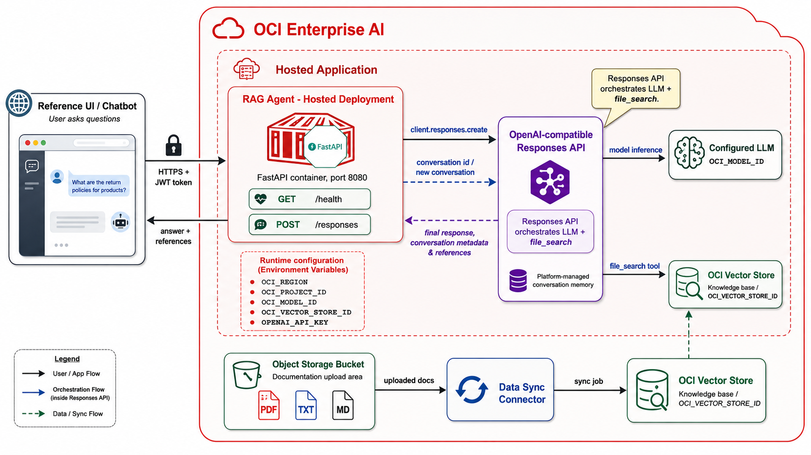

# OCI RAG Agent Blueprint




Retrieval-Augmented Generation becomes useful in production only when it is
treated as an engineered system: grounded retrieval, explicit runtime contracts,
repeatable deployment, and testable client behavior.

This repository is a **version 1.0 blueprint** for building and deploying a RAG
agent on **OCI Enterprise AI**, using **OCI Vector Store** for retrieval and the
OpenAI-compatible **Responses API** for generation.

Version 1.0 has been validated with OCI Hosted Deployments in both
non-streaming and streaming request modes. The Python CLI client and the Next.js
reference UI both support the Hosted Application invoke gateway behavior where
SSE `data:` frames are preserved but explicit `event:` names may be stripped.

## What Can I Build With This?

Use this blueprint when you need a working starting point for a production-style
RAG assistant on OCI, not just a minimal API sample.

Typical use cases include:

- An internal knowledge assistant that answers questions from company
  documentation, policies, runbooks, or onboarding material.
- A support assistant that retrieves product, troubleshooting, or service
  documentation before generating an answer.
- A technical documentation chatbot for engineering teams, field teams, or
  customers who need grounded answers with references.
- A policy, compliance, or procedure assistant where answers must stay connected
  to a controlled document collection.
- A workshop or proof-of-concept environment that demonstrates OCI Vector Store,
  the Responses API, streaming responses, short-term conversation memory, and a
  deployable reference UI.
- A reusable backend foundation for custom applications that need a
  `/responses` API compatible with both local development and OCI Hosted
  Application invoke endpoints.

The repository gives you the pieces needed to go from synchronized documents in
OCI Vector Store to a local or hosted chat experience: backend agent, request and
response contracts, streaming behavior, command-line validation, reference UI,
deployment guidance, and a guided Agent Factory workflow.

## Start Here

Use these guides depending on what you want to do:

- [Quickstart](QUICKSTART.md): end-to-end path from OCI resources to a working
  local and hosted RAG demo.
- [Agent API Usage](docs/agent-api-usage.md): exact endpoints, request payloads,
  non-streaming examples, streaming examples, and Hosted Application invoke
  notes.
- [Agent Factory](agent-factory/README.md): guided web UI and API for building
  and deploying the backend container to OCI Enterprise AI Hosted Applications.
- [Environment Variables](docs/environment-variables.md): complete runtime
  configuration reference.
- [OCI Enterprise AI Deployment Guide](docs/oci-enterprise-ai-deployment.md):
  detailed hosted deployment procedure.
- [Troubleshooting FAQ](TROUBLESHOOTING.md): recurring operational issues and
  fixes.

## What You Get

The blueprint includes:

- A FastAPI backend agent built around the Responses API.
- OCI Vector Store file search integration.
- Short-term conversation management through Responses API conversations.
- Streaming and non-streaming `/responses` request paths.
- A Python CLI test client for local and hosted endpoint validation.
- A Next.js reference chatbot UI with Markdown rendering and streaming support.
- An Agent Factory application for guided OCI Hosted Application deployment.
- Docker Compose local development for the backend and reference UI.
- JSON request and response schemas.
- Specs, tests, linting, and coverage rules that keep behavior reviewable.

## Runtime API

The agent exposes:

```text
GET /health
POST /responses
```

For local development:

```text
http://localhost:8080/health
http://localhost:8080/responses
```

For OCI Hosted Application invoke:

```text
https://inference.generativeai.<region>.oci.oraclecloud.com/20251112/hostedApplications/<hosted-application-ocid>/actions/invoke/health
https://inference.generativeai.<region>.oci.oraclecloud.com/20251112/hostedApplications/<hosted-application-ocid>/actions/invoke/responses
```

Use `stream: false` for one JSON response and `stream: true` for Server-Sent
Events.

See [Agent API Usage](docs/agent-api-usage.md) for complete payload examples and
curl commands.

## Local Demo

Before starting the demo, create a root `.env` file from `.env.sample` and fill
in the required OCI Enterprise AI values:

```bash
cp .env.sample .env
```

Start both local services:

```bash
./start_demo.sh
```

Build images and then start both services:

```bash
./start_demo.sh --build
```

The local deployment starts:

- `rag-agent` on `http://localhost:8080`
- `rag-ui` on `http://localhost:3000`

Open:

```text
http://localhost:3000
```

Stop the demo:

```bash
./stop_demo.sh
```

## Run The UI Without Docker

You can run the Next.js reference UI directly on your workstation:

```bash
cd ui
npm install
npm run dev
```

Then open:

```text
http://localhost:3000
```

Set the UI backend URL to either the local `/responses` endpoint or the Hosted
Application invoke `/responses` endpoint.

## Python CLI

From the repository root:

```bash
python -m clients.agent_cli \
  --endpoint "http://localhost:8080/responses" \
  --create-conversation true \
  --stream false \
  "Answer with only: ok"
```

Streaming:

```bash
python -m clients.agent_cli \
  --endpoint "http://localhost:8080/responses" \
  --create-conversation true \
  --stream true \
  "Answer with only: ok"
```

For Hosted Application validation, replace the endpoint with:

```text
https://inference.generativeai.<region>.oci.oraclecloud.com/20251112/hostedApplications/<hosted-application-ocid>/actions/invoke/responses
```

## Agent Factory

The `agent-factory/` application provides a guided deployment workflow for the
backend container:

- Resolve OCI resource names and OCIDs.
- Validate OCIR credentials.
- Build and push the backend image.
- Create or reuse a Hosted Application.
- Create a Hosted Deployment from the container artifact.
- Track command output and deployment status.

See [Agent Factory](agent-factory/README.md) for setup and usage.

## Development Approach

This repository follows spec-driven development.

Every new capability starts with a specification under `specs/`. Code is written
after the expected behavior, acceptance criteria, and test expectations are
documented.

This keeps the project aligned around a simple rule: implementation must conform
to the specification, not the other way around.

## Quality Standards

Python code in this repository must follow these standards:

- Source files include the required project header.
- Code is formatted with `black`.
- Code is checked with `pylint`.
- Unit tests are written with `pytest`.
- New functionality targets more than 80% test coverage.
- Work is considered done only when formatting, linting, tests, and related
  fixes are complete.

Next.js UI changes must pass:

```bash
cd ui
npm run test
npm run lint
npm run build
```

See [AGENTS.md](AGENTS.md) for the full working guidelines.

## Repository Structure

```text
.
├── AGENTS.md
├── CHANGELOG.md
├── QUICKSTART.md
├── TROUBLESHOOTING.md
├── agent/
├── agent-factory/
├── clients/
├── docs/
├── schemas/
├── specs/
├── tests/
└── ui/
```

## Current Status

Version 1.0 is ready for use as a working OCI Enterprise AI RAG blueprint. It has
been tested with:

- Local backend and reference UI.
- OCI Hosted Application health checks.
- Hosted Deployment non-streaming `/responses` requests.
- Hosted Deployment streaming `/responses` requests.
- Python CLI streaming and non-streaming clients.
- Next.js UI streaming against Hosted Application invoke.
